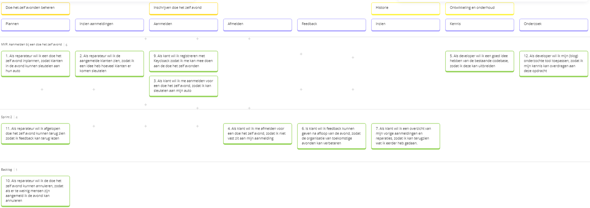

# Eigen bijdrage Mitchel Fleury

In dit document verantwoord ik mijn eigen bijdrage voor het beroepsproduct tijdens de minor DevOps. Ik behandel alle competenties en lever bewijs voor mijn bijdrage. In paragraaf 8 blik ik terug op de afgelopen twee weken en stel ik mijn tips en tops. Daarna concludeer ik mijn bijdrage in het beroepsproduct, geef ik feedback op het beroepsproduct en vertel ik wat ik meeneem naar het grote project.

## 1. Code/platform bijdrage

Competenties: *DevOps-1 Continuous Delivery*

- Ik heb een opzet gedaan voor de microservice `diymanagementapi` ([Pull Request](https://github.com/hanaim-devops/devops-bp-pitstop-uitbreiding-team-knoppert/pull/33)).
- Ik heb de historie van avonden van een klant inzichtelijk gemaakt. Dit is zowel een aanpassing in de back-end als front-end ([Pull Request](https://github.com/hanaim-devops/devops-bp-pitstop-uitbreiding-team-knoppert/pull/76)).

## 2. Bijdrage app configuratie/containers/kubernetes

Competenties: *DevOps-2 Orchestration, Containerization*

- Voor de `diymanagementapi` heb ik een [dockerfile](https://github.com/hanaim-devops/devops-bp-pitstop-uitbreiding-team-knoppert/pull/33/files#diff-792105b15c623708f22bd3b3c2987481f9844a21e55e0c16135b897dc9bc32f6) gemaakt, zodat deze in de docker-compose gebruikt kan worden.
- Ik heb de dockerfile ook toegevoegd aan de [docker-compose](https://github.com/hanaim-devops/devops-bp-pitstop-uitbreiding-team-knoppert/pull/33/files#diff-cd2ae9f5a501d16253a461b919af1523e71916a984989885e6783203f4ee252a).
- Ik heb een `yaml` [file](https://github.com/hanaim-devops/devops-bp-pitstop-uitbreiding-team-knoppert/pull/33/files#diff-69d70eca58af131e036a380f7199148c965b9e9d9a91134788b0a19e144eb2d2) aangemaakt, zodat de `diymanagementapi` ook gebruikt wordt in Kubernetes. Deze file is ook toegevoegd aan het [start script](https://github.com/hanaim-devops/devops-bp-pitstop-uitbreiding-team-knoppert/pull/33/files#diff-b2373aaccf35da43b56fe43cc9a6af19d975ed713aeed548708c6df9793a8bb2).

## 3. Bijdrage versiebeheer, CI/CD pipeline en/of monitoring

Competenties: *DevOps-1 - Continuous Delivery*, *DevOps-3 GitOps*, *DevOps-5 - SlackOps*

- Ik heb Prometheus opgezet als een service in [Docker](https://github.com/hanaim-devops/devops-bp-pitstop-uitbreiding-team-knoppert/pull/63/commits/d385ef88e5aaf159cbc55a839157e74b7b3d4e12) en in [k8s](https://github.com/hanaim-devops/devops-bp-pitstop-uitbreiding-team-knoppert/pull/63/commits/339acdf9e2b0554383b54e70c910116885599059).
- Ik heb Prometheus toevoegd aan de [API](https://github.com/hanaim-devops/devops-bp-pitstop-uitbreiding-team-knoppert/pull/63/commits/d385ef88e5aaf159cbc55a839157e74b7b3d4e12).
- Ik heb [custom metrics](https://github.com/hanaim-devops/devops-bp-pitstop-uitbreiding-team-knoppert/pull/69/commits/9074e0f1dc67a7b37df388dd08b148fef976ac13) voor Prometheus toegevoegd in de controller van de API.

## 4. Onderzoek

Competenties: *Nieuwsgierige houding*

Tijdens de coursefase heb ik [onderzoek](https://github.com/hanaim-devops/devops-blog-MitchelFleury/tree/main/src/prometheus-binnen-devops-omgeving) gedaan naar de monitoring- en altering tool Prometheus. Het opzetten voor de Prometheus service heb ik direct kunnen overnemen vanuit mijn onderzoek. Ik liep eerst vast om data op te halen van de API, omdat ik dacht dat dit persee via een docker-netwerk moest. Dit zorgde ervoor dat de API niet meer kon verbinden met de SQLServer, omdat deze niet in het zelfde netwerk zat. Ik kwam er uiteindelijk achter dat het netwerk overbodig was. Ook was het nog even uitzoeken hoe ik metrics moet openzetten in een .NET API, omdat ik dit nog niet had gedaan in mijn onderzoek. Uiteindelijk is het gelukt om mijn onderzoek toe te passen binnen pitstop.

## 5. Bijdrage code review/kwaliteit anderen en security

Competenties: *DevOps-7 - Attitude*, *DevOps-4 DevSecOps*

- Ik heb een [pull request](https://github.com/hanaim-devops/devops-bp-pitstop-uitbreiding-team-knoppert/pull/32) van Jelmer nagekeken. Bij deze PR heb ik een aantal comments achtergelaten. 2 comments gingen over 'TODO's' die nog in de code stonden. 2 comments gingen over GitHub Actions warnings. En ik had een vraag over wat een regel code deed, deze is beantwoord door Jelmer.
- Ik heb een [pull request](https://github.com/hanaim-devops/devops-bp-pitstop-uitbreiding-team-knoppert/pull/22) van Dirk nagekeken. Dit was een opzet van een service. Ik heb hier een comment achtergelaten dat ik nog de opzet voor de front-end miste.
- Ik heb een [pull request](https://github.com/hanaim-devops/devops-bp-pitstop-uitbreiding-team-knoppert/pull/70) van Dirk nagekeken. Dit was een PR waar Dirk een testplan had geschreven voor zijn userstory. Ik miste hier bij prerequisites voordat de testuitgevoerd werd. Ook vond ik de testen niet specifiek genoeg. Zo stond er niet bij welke knop er gedrukt moest worden of wat er in de tekstvelden ingevuld moest worden.
- Ik heb een [pull request](https://github.com/hanaim-devops/devops-bp-pitstop-uitbreiding-team-knoppert/pull/39) van Jelmer nagekeken. Dit was een PR waar ik een security issue vond. De secrets werden in de code op github gezet. Ik zag dit liever in een secrets of env file of iets dergelijks.

## 6. Bijdrage documentatie

Competenties: *DevOps-6 Onderzoek*

- Ik heb bijgedrage aan het opstellen van userstories en deze te mappen op Miro. 
- Ik heb meegeholpen met het opstellen van acceptatiecriteria voor de opgestelde userstories. Deze staan in de [GitHub issues](https://github.com/hanaim-devops/devops-bp-pitstop-uitbreiding-team-knoppert/issues).
- Ik heb voor de historie van avonden van een klant ook [handmatige end to end testen](https://github.com/hanaim-devops/devops-bp-pitstop-uitbreiding-team-knoppert/pull/88) geschreven.
- Ik heb voor het [c4 model](https://github.com/hanaim-devops/devops-bp-pitstop-uitbreiding-team-knoppert/pull/97) het container diagram gemaakt.

## 7. Bijdrage Agile werken, groepsproces, communicatie opdrachtgever en soft skills

Competenties: *DevOps-1 - Continuous Delivery*, *Agile*

- Ik heb een keer de DSU geleid. Ik nam de leiding en gaf iedereen om de beurt de mogelijkheid om te zeggen wat ze de dag ervoor hadden gedaan en wat ze die dag zouden gaan doen. Als laatst heb ik mezelf de beurt gegeven. Ik moest een keer ingrijpen, omdat we in details gingen over een taak en dit is niet de bedoeling tijdens de DSU.
- Ik heb tijdens de eerste sprint review genotuleerd. Ik heb dit eerst voor mezelf [snel opgeschreven](https://minor-devops-2024.slack.com/archives/C07QFQ7ATSQ/p1729244846816539) en dit vervolgens netjes uitgewerkt en in [GitHub](https://github.com/hanaim-devops/devops-bp-pitstop-uitbreiding-team-knoppert/pull/43/files#diff-021b1de5034fa544897bc7fb1aa9ab61ba189e5457d808be7ffbb2992ee7d793) gezet, zodat mijn groepsgenoten deze notulen kunnen teruglezen.
- Ik de tweede [sprint planning](https://github.com/hanaim-devops/devops-bp-pitstop-uitbreiding-team-knoppert/pull/54/files) geleid. Ik heb een agenda opgesteld en deze als eerste laten zien in de meeting. Vervolgens heb ik alle punten op de agenda behandeld.

## 8. Leerervaringen

Competenties: *DevOps-7 - Attitude*

- Een top voor mezelf is dat ik mijn taken goed hebben bijgehouden op het sprintbord. In vorige projecten en op stage merkte ik dat ik dit vaak vergat. Het gevolg hiervan was dat het voor mijn groepsgenoten niet duidelijk was wat de status van mijn taak is. Ik heb tijdens het beroepsproduct er op gelet dat ik de status van mijn taak bijhoudt.
- Een top voor mezelf is dat ik zelfstandiger heb gewerkt. In eerdere projecten op school merkte ik dat ik vaak te snel om hulp vroeg. Ik heb tijdens dit beroepsproduct er op gelet dat ik eerst de tijd nam om het zelf uit te zoeken.

- Een tip voor mezelf is dat ik van te voren en tijdens het werken aan een taak goed moet kijken naar de acceptatiecriteria. Ik doe dit niet altijd en dan wanneer ik denk dat ik klaar ben met een taak blijkt het dat ik toch nog iets mis of dat ik iets heb gemaakt dat niet binnen mijn taak hoort. Dit zou ik in het grote project willen verbeteren, zodat ik niet extra tijd besteed aan een taak.
- Een tip voor mezelf is dat ik snel afgeleid raak. Ik wil voor een volgend project hier iets op vinden door bijvoorbeeld voor bepaalde delen van de dag even apart te zitten van de groep.

## 9. Conclusie & feedback

Competenties: *DevOps-7 - Attitude*

Conclusie

Ik kijk positief terug op mijn bijdrage aan het project en de diverse DevOps-competenties die ik heb kunnen inzetten en ontwikkelen. Mijn werk aan de microservice-architectuur, het opzetten van Docker- en Kubernetes-configuraties, en de integratie van Prometheus monitoring hebben ervoor gezorgd dat het team een stabiele en schaalbare infrastructuur kon bouwen. Ook in de CI/CD-processen en GitOps heb ik mijn steentje bijgedragen. Door het uitvoeren van code reviews en het signaleren van security-issues heb ik de kwaliteit en veiligheid van onze codebase verbeterd.

Daarnaast heb ik mezelf kunnen ontwikkelen in soft skills en groepsprocessen. Het leiden van de DSU en sprint planningen, en het notuleren tijdens sprint reviews hebben me geholpen om beter te communiceren en mijn Agile-vaardigheden te versterken. Hierdoor was ik in staat om een positieve bijdrage te leveren aan de samenwerking binnen ons team en onze gezamenlijke doelen.

Als ik terug kijk op afgelopen twee weken ben ik tevreden over mezelf. Zowel in de soft skills als de functionaliteit die ik heb gemaakt. Ik vond de twee weken wel erg kort voor alle scrum sessies (sprint planning/review en retrospective). We hadden na de retrospecitive nog maar 2,5 dag om onszelf te verbeteren, dit is wel erg kort om verbetering te kunnen zien. Natuurlijk kunnen de punten die hieruit zijn gekomen wel worden meegenomen naar het grote project.

Ik neem mijn opgedane kennis mee naar het volgende project. Zoals de afspraken die we hebben gemaakt over het samenwerken in GitHub. Ik zou de afspraken wel wat willen aanscherpen, bijvoorbeeld de namen die we geven aan branches. Daarnaast neem ik natuurlijk ook de tips mee die ik voor mezelf heb opgesteld.
