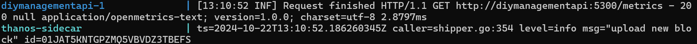
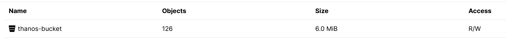
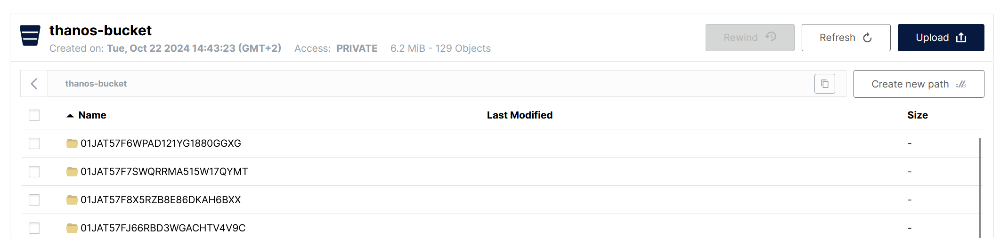

wat je wel moet doen handmatig; 

ga naar;

`http://localhost:9001`

login met de gegevens uit de docker compose.

controleer of 'thanos-bucket' bestaat of niet. zo niet; 
create een nieuwe bucket met de naam; 'thanos-bucket' 

restart de compose enz. 

TODO; dit netjes maken natuurlijk.en de docker configs enz weer netjes maken. Prometheus yamls en docker compose.

